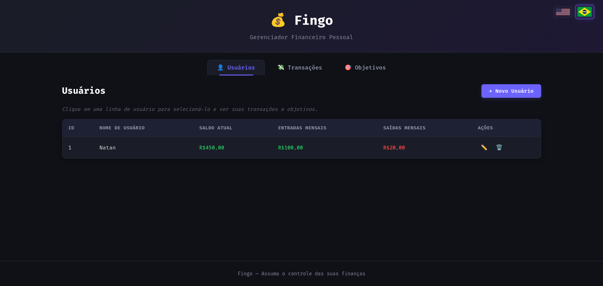
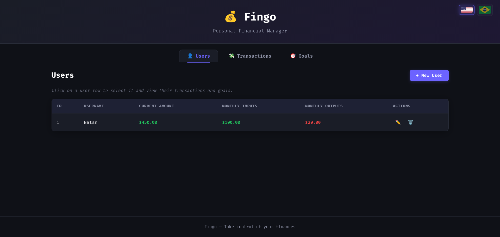

# Fingo — Financial Goals

[](https://github.com/)
[](https://golang.org)
[](https://www.sqlite.org)
[](#license)

Um projeto para gerenciar usuários, transações e metas financeiras de forma simples, concisa e didática — escrito em Go com dependências mínimas e uma GUI gerada com auxílio de IA.

---

Índice
- PT-BR (Português)
  - Sobre
  - Funcionalidades
  - Decisões de Design
  - Instalação Rápida
  - Como usar
  - Contribuindo
  - Licença
- EN (English)
  - About
  - Features
  - Design decisions
  - Quick start
  - Usage
  - Contributing
  - License

---

## PT-BR

### Sobre
Fingo é uma aplicação demonstrativa para controle de objetivos financeiros simples. O foco do projeto é:
- mostrar habilidades em Go;
- manter o código conciso e direto ao ponto;
- evitar dependências pesadas (apenas drivers SQLite);
- construir a maior parte das interações com o banco manualmente (sem ORM).

A GUI foi gerada com auxílio de IA para acelerar a prototipação — o backend e as regras de negócio foram implementados manualmente.



### Funcionalidades
1. Criação de usuário, transação e metas com garantia de atomicidade.
2. Apenas drivers SQLite como dependência externa.
3. Endpoints HTTP leves construídos com a biblioteca padrão de Go.
4. GUI simples (prototípica) para demonstrar fluxo básico.
5. Testes e scripts auxiliares para tarefas comuns.

### Decisões de Design
- SQLite foi escolhido por ser um projeto simples e de demonstração de habilidades, para projetos Web não é a melhor escolha, mas nesse caso funciona bem, e sem a necessidade de docker ou download de um banco de dados como MySQL.
- Não foi usado ORM nem framework Web — objetivo é demonstrar domínio do ecossistema padrão do Go.
- Implementações manuais de queries ajudam a entender detalhes, mas geram boilerplate — para projetos maiores, você provavelmente usaria um ORM ou uma camada de query builder.

### Instalação Rápida
Pré-requisitos: Go (1.20+ recomendado), Git.

1. Clone:
   git clone https://github.com/NatanCorreiaS/fingo.git
2. Entre na pasta:
   cd fingo
3. Compile:
   go build ./...
4. Rode:
   ./fingo  # ou go run ./cmd/fingo (dependendo da árvore do projeto)

Observação: o projeto utiliza SQLite — o banco será criado automaticamente no diretório local.

### Como usar

Observação importante sobre o tipo `Money`: os campos do tipo `Money` no modelo representam valores em centavos (inteiro). Ex.: R$ 10,50 -> 1050. Para evitar perda de precisão, o backend espera um número inteiro (centavos) nos campos monetários.

Endpoints (exemplos) com JSON e comandos `curl`:

- Criar usuário (POST /users)

Inclua no body:
```json
{
  "user_name": "Alice",
  "current_amount": 105000,
  "monthly_inputs": 500000,
  "monthly_outputs": 200000
}
```

Exemplo `curl`:
```bash
curl -sS -X POST http://localhost:8080/users \
  -H "Content-Type: application/json" \
  -d '{"user_name":"Alice","current_amount":105000,"monthly_inputs":500000,"monthly_outputs":200000}'
```

- Criar transação (POST /transactions)

Body esperado:
```json
{
  "description": "Compra no mercado",
  "amount": 7500,
  "is_debt": false,
  "user_id": 1
}
```

`curl`:
```bash
curl -sS -X POST http://localhost:8080/transactions \
  -H "Content-Type: application/json" \
  -d '{"description":"Compra no mercado","amount":7500,"is_debt":false,"user_id":1}'
```

- Criar meta (POST /goals)

Body para criar uma meta:
```json
{
  "name": "Notebook novo",
  "description": "Economizar para trocar meu notebook",
  "price": 350000,
  "pros": "Melhor performance",
  "cons": "Custo elevado",
  "user_id": 1,
  "deadline": "2026-12-31"
}
```

`curl`:
```bash
curl -sS -X POST http://localhost:8080/goals \
  -H "Content-Type: application/json" \
  -d '{"name":"Notebook novo","description":"Economizar para trocar meu notebook","price":350000,"pros":"Melhor performance","cons":"Custo elevado","user_id":1,"deadline":"2026-12-31"}'
```

- Obter usuário com ID (GET /users/:id)

`curl`:
```bash
curl -sS http://localhost:8080/users/1
```

Resposta (exemplo):
```json
{
  "id": 1,
  "user_name": "Alice",
  "current_amount": 105000,
  "monthly_inputs": 500000,
  "monthly_outputs": 200000
}
```

- Atualizar parcialmente usuário (PATCH /users/{id})

Ex.: atualizar apenas o nome e o current_amount:
```json
{
  "user_name": "Alice Silva",
  "current_amount": 110000
}
```

`curl`:
```bash
curl -sS -X PATCH http://localhost:8080/users/1 \
  -H "Content-Type: application/json" \
  -d '{"user_name":"Alice Silva","current_amount":110000}'
```

Dicas rápidas:
- Certifique-se de que tenha a ferramenta CURL em seu terminal.
- Sempre envia JSON válido com `Content-Type: application/json`.
- Valores monetários usem inteiros em centavos.
- `created_at` e `id` são gerados pelo backend; não os envie ao criar recursos.
- `deadline` (em `goals`) é uma string (ex.: `"YYYY-MM-DD"`), siga o formato ISO para consistência.

### Arquitetura (resumida)
- Backend: Go (std lib)
- Banco: SQLite (arquivo local)
- GUI: protótipo estático gerado com auxílio de IA (HTML/CSS/JS)
- Não há dependência de contêineres para facilitar execução local.

### Licença
GPL3 — consulte o arquivo `LICENSE` para detalhes.

---

## EN (English)

### About
Fingo is a small demonstrative application to manage financial goals, users and transactions. The project is written in Go with minimal external dependencies and aims to be concise and educational.

The GUI is an AI-assisted prototype; the backend logic and database interactions are handcrafted.



### Features
1. Create users, transactions and goals with atomic operations.
2. Only SQLite drivers as external dependencies.
3. Lightweight HTTP endpoints built with Go's standard library.
4. Prototype GUI to demonstrate basic flows.
5. Tests and helper scripts for common tasks.

### Design decisions
- SQLite was chosen because it's a simple project and a way to demonstrate skills. It's not the best choice for web projects, but in this case it works well, and without the need for Docker or downloading a database like MySQL.
- No ORM or web framework was used — the goal is to demonstrate mastery of the standard Go ecosystem.
- Manual query implementations help to understand details, but they generate boilerplate — for larger projects, you would probably use an ORM or a query builder layer.### Quick start
Requirements: Go (1.20+ recommended), Git.

1. Clone:
   git clone https://github.com/NatanCorreiaS/fingo.git
2. Enter:
   cd fingo
3. Build:
   go build ./...
4. Run:
   ./fingo  # or go run ./cmd/fingo

Note: SQLite DB file will be created automatically in the project folder.

### Usage

Important note about `Money` fields: they are represented in cents (integers). Example: $10.50 -> 1050. The API expects integer cent values for monetary fields.

Endpoints with JSON examples and `curl`:

- Create a user (POST /users)

Request body:
```json
{
  "user_name": "Alice",
  "current_amount": 105000,
  "monthly_inputs": 500000,
  "monthly_outputs": 200000
}
```

`curl`:
```bash
curl -sS -X POST http://localhost:8080/users \
  -H "Content-Type: application/json" \
  -d '{"user_name":"Alice","current_amount":105000,"monthly_inputs":500000,"monthly_outputs":200000}'
```

- Create a transaction (POST /transactions)

Request body:
```json
{
  "description": "Grocery shopping",
  "amount": 7500,
  "is_debt": false,
  "user_id": 1
}
```

`curl`:
```bash
curl -sS -X POST http://localhost:8080/transactions \
  -H "Content-Type: application/json" \
  -d '{"description":"Grocery shopping","amount":7500,"is_debt":false,"user_id":1}'
```

- Create a goal (POST /goals)

Request body:
```json
{
  "name": "New Laptop",
  "description": "Save to replace my laptop",
  "price": 350000,
  "pros": "Better performance",
  "cons": "High cost",
  "user_id": 1,
  "deadline": "2026-12-31"
}
```

`curl`:
```bash
curl -sS -X POST http://localhost:8080/goals \
  -H "Content-Type: application/json" \
  -d '{"name":"New Laptop","description":"Save to replace my laptop","price":350000,"pros":"Better performance","cons":"High cost","user_id":1,"deadline":"2026-12-31"}'
```

- Get user by ID (GET /users/:id)

`curl`:
```bash
curl -sS http://localhost:8080/users/1
```

Sample response:
```json
{
  "id": 1,
  "user_name": "Alice",
  "current_amount": 105000,
  "monthly_inputs": 500000,
  "monthly_outputs": 200000
}
```

- Partial update for user (PATCH /users/{id})

Example body:
```json
{
  "user_name": "Alice Smith",
  "current_amount": 110000
}
```

`curl`:
```bash
curl -sS -X PATCH http://localhost:8080/users/1 \
  -H "Content-Type: application/json" \
  -d '{"user_name":"Alice Smith","current_amount":110000}'
```

Quick tips:
- Send `Content-Type: application/json`.
- Money values are integers in cents.
- Do not send `id` or `created_at` when creating resources (they are server-generated).
- Use ISO dates (YYYY-MM-DD) for `deadline` in goals.

### Architecture (brief)
- Certify yourself that you have the tool CURL in your terminal.
- Backend: Go (standard library)
- Database: SQLite (file-based)
- GUI: AI-assisted static prototype (HTML/CSS/JS)
- No container dependency for quick local runs.

### License
GPL3 — see `LICENSE`.